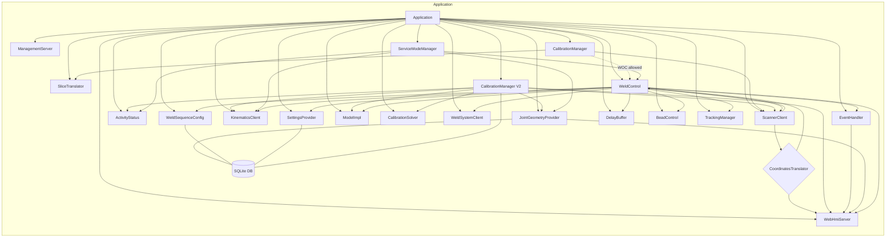

## Adaptio Module Interaction Diagram

This document shows how the main Adaptio modules interact, based on `src/main/application.cc` and `src/main.cc`.

### High-level architecture

```mermaid
flowchart LR
  subgraph External Processes
    PLC[Controller Messenger / PLC]
    SCN[Scanner Application]
    HMI[Web HMI (TCP 5555/5556)]
    PRM[Prometheus Exposer]
    DB[(SQLite Database)]
    FS[(Logs / Image files)]
  end

  subgraph Adaptio Application (zevs EventLoop)
    APP[Application]
    MGMT[ManagementServer]
    WM[WebHmiServer]
    SMM[ServiceModeManager]
    KIN[KinematicsClient]
    SC[ScannerClient]
    WSC[WeldSystemClient]
    JG[JointGeometryProvider]
    IM[ImageLoggingManager]
    CM1[CalibrationManager]
    CM2[CalibrationManager V2]
    WC[WeldControl]
    EH[EventHandler]
  end

  APP --> KIN
  APP --> SC
  APP --> WSC
  APP --> MGMT
  WM <--> HMI

  %% External process bindings (inproc endpoints share the same base url "adaptio")
  KIN <-- inproc --> PLC
  SC <-- inproc --> SCN
  WSC <-- inproc --> PLC

  %% Data/config persistence and metrics
  JG --- DB
  WC --- DB
  CM2 --- DB
  IM --- FS

  %% HMI integration
  EH --> WM
  JG --> WM
  IM --> WM
  SMM --> WM

  %% Control/coordination
  SMM --> KIN
  SMM --> JG
  SMM --> WC
  MGMT --> WC
  MGMT --> JG
  MGMT --> CM1
  MGMT --> CM2

  %% Scanner data flow
  SC --> WC

  %% Metrics (illustrative)
  WC --> PRM
  SC --> PRM
  CM2 --> PRM
```

### Internal module interactions (Application process)



### Endpoints and sockets

- Web HMI SUB/PUB: `tcp://0.0.0.0:5555` (SUB), `tcp://0.0.0.0:5556` (PUB)
- Intra-process (inproc) endpoints share base url `adaptio`:
  - Kinematics: `inproc://adaptio/kinematics`
  - Scanner: `inproc://adaptio/scanner`
  - Weld System: `inproc://adaptio/weld-system`
  - Management: `inproc://adaptio/management`

Notes
- Solid arrows indicate direct calls or observer relationships inside the `Application` process.
- Dashed arrows indicate coordination or guard checks.
- Double-line connections indicate persistence or storage access.
